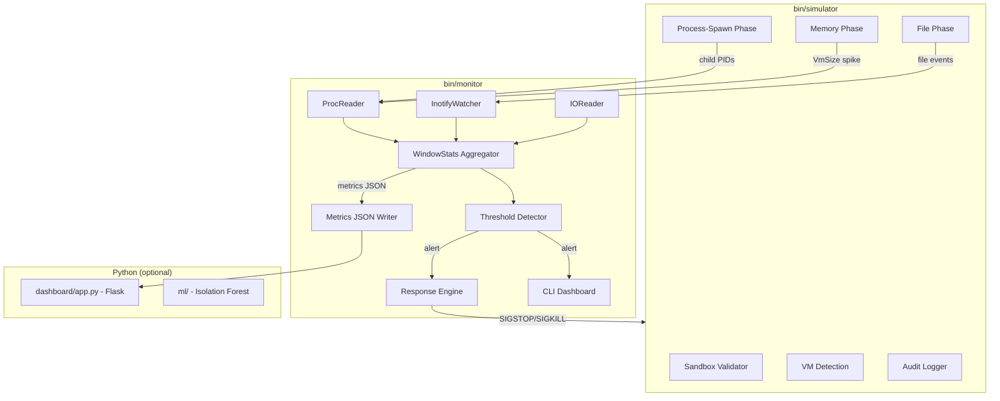
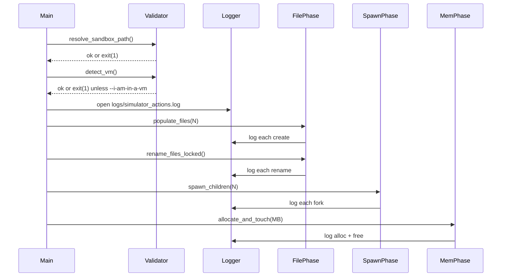
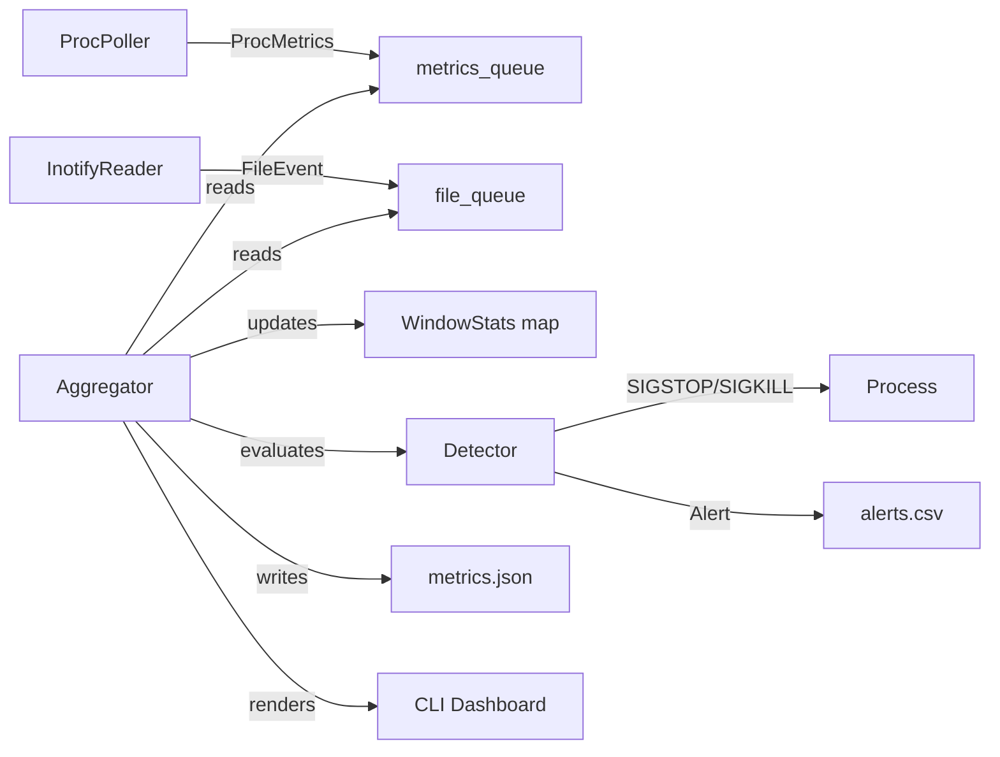

# Design Document: Ransomware Defense Simulator

## Overview

This project is a two-binary C++17 system for an OS course (AI 3002). It runs exclusively on Ubuntu Linux and uses only POSIX APIs and the C++ standard library — zero external C++ dependencies.

- `bin/simulator` — mimics ransomware behavioral signatures inside a sandboxed directory using reversible, non-destructive operations.
- `bin/monitor` — observes live OS signals via `/proc` and `inotify`, applies threshold-based detection, responds with `SIGSTOP`/`SIGKILL`, and surfaces metrics on a CLI and web dashboard.

Optional Python components handle the web dashboard (Flask) and ML anomaly scoring (scikit-learn Isolation Forest).

---

## Architecture



---

## Components and Interfaces

### 1. Simulator (`src/simulator.cpp`)

**Responsibilities:**
- Validate sandbox path at startup (refuse to run if resolved path ≠ `./test_env/`)
- Detect VM environment; require `--i-am-in-a-vm` flag otherwise
- Execute three behavioral phases sequentially or concurrently (configurable)
- Write every action to `logs/simulator_actions.log` with ISO-8601 timestamps

**CLI Interface:**
```
./bin/simulator [--files=N] [--children=N] [--mem-mb=N] [--i-am-in-a-vm]
```
Defaults: `--files=100 --children=8 --mem-mb=128`

**Phase Execution Flow:**


**VM Detection Logic:**
1. Read `/sys/class/dmi/id/product_name` — if it contains "VirtualBox", "VMware", "KVM", "QEMU", etc. → confirmed VM
2. Run `systemd-detect-virt` via `popen()` — if output is not "none" → confirmed VM
3. If neither confirms VM and `--i-am-in-a-vm` not provided → print warning and `exit(1)`

**File Phase:**
- Create `N` files named `dummy_000.dat` … `dummy_NNN.dat` with random 4KB content
- Rename each to `<filename>.simlocked` (simulates mass file locking)
- Optionally apply reversible XOR with key `0xAB` logged to audit log

**Spawn Phase:**
- `fork()` → child calls `exec("/bin/sleep", "1")` or a trivial no-op
- Parent calls `wait()` for all children after spawning
- Rate is controlled by spawning all `N` children in rapid succession

**Memory Phase:**
- `malloc(MB * 1024 * 1024)` then touch every page with a write loop
- `free()` after configured hold duration (default: 2 seconds)

---

### 2. Monitor (`src/monitor.cpp`, `src/proc_reader.cpp`)

**Responsibilities:**
- Poll `/proc` every 500ms for all tracked PIDs
- Receive `inotify` events on `./test_env/`
- Maintain per-PID `WindowStats` with rolling 1-second buckets
- Evaluate thresholds; emit `Alert` on breach
- Render CLI dashboard in-place
- Write `logs/metrics.json` (live feed for web dashboard)
- Write `logs/alerts.csv` (structured alert log)

**Main Loop Design:**

Three concurrent threads:
1. **ProcPoller thread** — polls `/proc/[pid]/stat`, `/proc/[pid]/status`, `/proc/[pid]/io` every 500ms
2. **InotifyReader thread** — blocking `read()` on inotify fd, dispatches `FileEvent` to shared queue
3. **Aggregator/Detector thread** — wakes every 1 second, drains queues, updates `WindowStats`, evaluates thresholds, triggers responses

Thread safety: a single `std::mutex` protects the shared `WindowStats` map and alert log.



---

### 3. `proc_reader` (`src/proc_reader.cpp`, `include/proc_reader.h`)

**Interface:**
```cpp
// Reads /proc/[pid]/stat and /proc/[pid]/status
ProcMetrics read_proc_metrics(pid_t pid);

// Reads /proc/[pid]/io
void read_proc_io(pid_t pid, ProcMetrics& m);

// Returns list of child PIDs from /proc/[pid]/task or by scanning /proc
std::vector<pid_t> get_children(pid_t parent_pid);

// Scan /proc for all PIDs (for child discovery)
std::vector<pid_t> list_all_pids();
```

**`/proc/[pid]/stat` parsing:**
- Field 3 = process state (`R`, `S`, `Z`, etc.)
- Field 23 = `vsize` in bytes

**`/proc/[pid]/status` parsing:**
- `VmSize:` line for human-readable memory cross-check
- `PPid:` for parent PID (child discovery)

**`/proc/[pid]/io` parsing:**
- `read_bytes:` cumulative bytes read
- `write_bytes:` cumulative bytes written

---

### 4. InotifyWatcher (`src/monitor.cpp` or extracted class)

```cpp
class InotifyWatcher {
public:
    InotifyWatcher(const std::string& path);
    ~InotifyWatcher();
    // Blocks up to timeout_ms using poll(), then drains available events.
    // Returns empty vector on timeout — avoids both spin-waiting and infinite blocking.
    std::vector<FileEvent> poll_events(int timeout_ms = 100);
private:
    int inotify_fd_;      // opened with inotify_init1(0) — blocking fd
    int watch_descriptor_;
};
```

Watches: `IN_CREATE | IN_MODIFY | IN_MOVED_FROM | IN_MOVED_TO | IN_DELETE`

---

### 5. Threshold Configuration

Defined once in `include/metrics.h` as a plain struct (no magic numbers in detection logic):

```cpp
struct DetectionConfig {
    // Thresholds — TODO: tune against your own baseline data
    double file_events_per_sec    = 20.0;  // >20 renames/creates/sec = suspicious
    double spawns_per_sec         = 5.0;   // >5 new child processes/sec = suspicious
    double mem_delta_mb_per_sec   = 50.0;  // >50 MB/sec allocation rate = suspicious
    double io_bytes_per_sec       = 10.0 * 1024 * 1024;  // >10 MB/sec I/O = suspicious

    // Response
    bool use_sigkill = false;  // false = SIGSTOP (suspend), true = SIGKILL (terminate)

    // Window
    int window_seconds = 1;   // evaluation window size in seconds
};
```

---

### 6. CLI Dashboard (`src/monitor.cpp`)

Renders using ANSI escape codes, no external library. Refreshed every 1 second.

**Layout:**
```
┌─────────────────────────────────────────────────────────────┐
│  [ NORMAL ]  or  [ !! ALERT !! ]          uptime: 00:01:23  │
├─────────────────────────────────────────────────────────────┤
│  File Events/sec   [████████░░░░░░░░░░░░]  12.4 /s          │
│  Process Spawns/s  [██░░░░░░░░░░░░░░░░░░]   1.0 /s          │
│  Memory Delta MB/s [░░░░░░░░░░░░░░░░░░░░]   0.0 MB/s        │
│  I/O Bytes/sec     [████░░░░░░░░░░░░░░░░]   2.1 MB/s        │
├─────────────────────────────────────────────────────────────┤
│  ALERT LOG (last 5)                                         │
│  2026-09-01T14:23:01Z  PID 1234  file_events=47.2/s  STOP  │
└─────────────────────────────────────────────────────────────┘
```

ANSI colors used:
- Status line normal: `\033[92m` (bright green `#00ff88` approximation)
- Status line alert: `\033[91m` + `\033[5m` (red + blink)
- Metric bars: `\033[96m` (cyan) normal, `\033[93m` (amber) elevated, `\033[91m` (red) alert
- Alert log newest row: `\033[97m` (bright white)

In-place refresh: `\033[H` (cursor home) + `\033[J` (clear screen) at each render tick.

---

### 7. Web Dashboard (`dashboard/app.py`)

**Stack:** Flask + Jinja2 templates + Chart.js + vanilla JS polling

**Endpoints:**
```
GET /              → renders index.html
GET /api/metrics   → returns latest metrics.json snapshot as JSON
GET /api/alerts    → returns last 100 rows of alerts.csv as JSON array
```

**Frontend polling:** `setInterval(() => fetchAndUpdate(), 1000)` — updates all elements without page reload.

**Layout sections:**
1. Hero status banner (full width, pulsing green or flashing red)
2. Four Chart.js line charts in a 2×2 grid (60-second rolling window)
3. Process table (PID, name, state, memory, I/O) with row color coding
4. Alert log table (timestamp, PID, name, reason, metrics) with auto-prepend

**Color palette constants** (defined once in CSS variables):
```css
:root {
  --bg:       #0a0a0f;
  --normal:   #00ff88;
  --warning:  #ffcc00;
  --alert:    #ff3333;
  --cyan:     #00e5ff;
  --violet:   #bf5fff;
  --grid:     rgba(255,255,255,0.15);
}
```

---

### 8. `logs/metrics.json` (Monitor → Web Dashboard feed)

Written atomically every 1 second by the monitor (write to temp file, then `rename()`). This is the **current snapshot only** — it is overwritten each second.

For ML feature history, the monitor also appends each snapshot as a newline-delimited JSON entry to `logs/metrics_history.jsonl`. This file accumulates indefinitely and is what `ml/export_features.py` reads.

```json
{
  "timestamp": "2026-09-01T14:23:01Z",
  "status": "normal",
  "alert_pid": null,
  "alert_reason": null,
  "processes": [
    {
      "pid": 1234,
      "name": "simulator",
      "state": "R",
      "vsize_mb": 132.4,
      "read_bps": 1048576,
      "write_bps": 524288,
      "threat_level": "normal"
    }
  ],
  "metrics": {
    "file_events_per_sec": 12.4,
    "spawns_per_sec": 1.0,
    "mem_delta_mb_per_sec": 0.0,
    "io_bytes_per_sec": 2097152
  }
}
```

---

## Data Models

### `include/metrics.h`

```cpp
#pragma once
#include <string>
#include <cstdint>
#include <ctime>

struct ProcMetrics {
    pid_t       pid;
    std::string name;
    char        state;          // R, S, D, Z, T
    uint64_t    vsize_bytes;    // virtual memory size
    uint64_t    read_bytes;     // cumulative from /proc/[pid]/io
    uint64_t    write_bytes;
};

struct FileEvent {
    std::string path;
    uint32_t    inotify_mask;   // IN_CREATE, IN_MODIFY, etc.
    time_t      timestamp;
};

struct WindowStats {
    double   file_events_per_sec  = 0.0;
    double   spawns_per_sec       = 0.0;
    double   mem_delta_mb_per_sec = 0.0;
    double   io_bytes_per_sec     = 0.0;
    uint64_t window_start_epoch   = 0;
};

struct Alert {
    std::string timestamp;       // ISO-8601
    pid_t       pid;
    std::string trigger_reason;  // e.g., "file_events_per_sec"
    WindowStats metrics;
};

struct DetectionConfig {
    double file_events_per_sec   = 20.0;
    double spawns_per_sec        = 5.0;
    double mem_delta_mb_per_sec  = 50.0;
    double io_bytes_per_sec      = 10.0 * 1024 * 1024;
    bool   use_sigkill           = false;
    int    window_seconds        = 1;
};
```

---

## Correctness Properties

A property is a characteristic or behavior that should hold true across all valid executions — a formal statement about what the system should do. Properties serve as the bridge between human-readable specifications and machine-verifiable correctness guarantees.

### Property-Based Testing Overview

Property-based testing (PBT) validates software correctness by testing universal properties across many generated inputs. Each property is a formal specification that should hold for all valid inputs.

The PBT library used for Python components is **[Hypothesis](https://hypothesis.readthedocs.io/)**. C++ property-based tests are implemented using **Google Test parameterized tests** (no external C++ libraries — rapidcheck is explicitly excluded to satisfy Req 8.3). Python/Hypothesis covers the properties that benefit most from generative testing (CSV round-trip, JSON round-trip, delta monotonicity via numeric generators).

---

Property 1: Sandbox path confinement
*For any* file path produced by the Simulator, the resolved absolute path SHALL begin with the resolved absolute path of `./test_env/`. No file operation targets a path outside this prefix.
**Validates: Requirements 1.2**

---

Property 2: File lock reversibility
*For any* dummy file created by the Simulator, after the rename-to-`.simlocked` operation, a rename back to the original filename produces a file with identical content to the original.
**Validates: Requirements 1.3**

---

Property 3: Audit log completeness
*For any* simulator run with N files and M children, the audit log SHALL contain at least N rename entries and M fork entries — the count of logged actions is never less than the count of actual operations performed.
**Validates: Requirements 1.5, 2.6**

---

Property 4: ProcMetrics parse consistency
*For any* valid `/proc/[pid]/stat` string, `read_proc_metrics()` SHALL parse it into a `ProcMetrics` where `vsize_bytes > 0` and `state` is one of `{R, S, D, Z, T, I}`.
**Validates: Requirements 3.1**

---

Property 5: WindowStats monotonic I/O delta
*For any* two consecutive `ProcMetrics` readings for the same PID where `read_bytes` and `write_bytes` are non-decreasing (as guaranteed by the kernel), the computed I/O delta SHALL be ≥ 0.
**Validates: Requirements 5.2**

---

Property 6: Threshold detection soundness
*For any* `WindowStats` value where all four metrics are strictly below their configured thresholds, the detector SHALL emit zero alerts. No false positives on sub-threshold input.
**Validates: Requirements 6.2**

---

Property 7: Alert CSV round-trip
*For any* `Alert` struct written to `logs/alerts.csv`, parsing that CSV row back into fields SHALL recover the original timestamp, PID, trigger_reason, and metric values without loss.
**Validates: Requirements 6.4**

---

Property 8: Metrics JSON round-trip
*For any* `WindowStats` snapshot written to `logs/metrics.json`, deserializing the JSON SHALL produce metric values equal (within floating-point epsilon) to the original struct values.
**Validates: Requirements 10.3, 10.8**

---

## Error Handling

| Scenario | Behavior |
|---|---|
| Sandbox path resolves outside `./test_env/` | `exit(1)` with clear error message |
| VM not detected and `--i-am-in-a-vm` absent | `exit(1)` with loud warning |
| `/proc/[pid]/stat` unreadable (process exited) | Remove PID from monitored set, log warn |
| `inotify_init()` fails | `exit(1)` — inotify unavailable is fatal |
| `inotify_add_watch()` fails | `exit(1)` — cannot monitor without watch |
| `logs/` directory missing | Create it at startup |
| `metrics.json` write fails | Log error, continue — non-fatal |
| `alerts.csv` write fails | Log error to stderr, continue |
| `SIGSTOP`/`SIGKILL` fails (permission) | Log error with errno, continue monitoring |
| Simulator child exits before wait() | `waitpid()` with `WNOHANG` to reap cleanly |

---

## Testing Strategy

### Dual Testing Approach

Both unit tests and property-based tests are required and complementary:
- **Unit tests** verify specific examples, edge cases, and error conditions
- **Property tests** verify universal properties hold across all generated inputs

### C++ Testing

- Framework: **Google Test (gtest)** for unit tests and parameterized property-style tests
- No external C++ testing libraries beyond gtest — rapidcheck and similar are excluded to satisfy Req 8.3
- Test binary: `bin/tests`
- Location: `tests/` directory

Unit test coverage:
- `proc_reader`: parse a known `/proc/stat` fixture string → verify correct field extraction
- `WindowStats`: delta computation with known before/after values
- Sandbox path validator: paths inside sandbox → pass; paths outside → fail
- Alert CSV serializer: known `Alert` → write → parse → compare fields

Property-style tests using Google Test `INSTANTIATE_TEST_SUITE_P` (minimum 100 parameter cases each):
- **Property 1**: Table of random-ish filenames; verify sandbox prefix invariant holds for all
  *Feature: ransomware-defense-simulator, Property 1: Sandbox path confinement*
- **Property 2**: Table of random file contents; rename to `.simlocked` and back; verify content identity
  *Feature: ransomware-defense-simulator, Property 2: File lock reversibility*
- **Property 4**: Table of valid `/proc/stat` format strings; verify parse invariants (state in valid set, vsize > 0)
  *Feature: ransomware-defense-simulator, Property 4: ProcMetrics parse consistency*
- **Property 5**: Table of (before, after) I/O byte pairs with after ≥ before; verify delta ≥ 0
  *Feature: ransomware-defense-simulator, Property 5: WindowStats monotonic I/O delta*
- **Property 6**: Table of sub-threshold `WindowStats` values; verify zero alerts emitted
  *Feature: ransomware-defense-simulator, Property 6: Threshold detection soundness*

### Python Testing

- Framework: **pytest** + **Hypothesis** for property-based tests
- Covers `dashboard/app.py` API endpoints, `ml/` feature extraction, and the properties best suited to generative testing

Property test coverage (each test runs minimum 100 Hypothesis examples):
- **Property 3**: Generate random (N, M) pairs; run simulator phases; verify log entry count ≥ N+M
  *Feature: ransomware-defense-simulator, Property 3: Audit log completeness*
- **Property 7**: Generate random Alert-equivalent dicts; write to CSV; parse back; verify round-trip
  *Feature: ransomware-defense-simulator, Property 7: Alert CSV round-trip*
- **Property 8**: Generate random `WindowStats`-equivalent dicts; serialize to JSON; deserialize; verify floating-point equality within epsilon
  *Feature: ransomware-defense-simulator, Property 8: Metrics JSON round-trip*

### Integration / Acceptance Tests

Shell script `tests/integration_test.sh`:
1. Start `bin/monitor` in background
2. Wait 5 seconds; verify `logs/alerts.csv` is empty (zero false positives on idle)
3. Start `bin/simulator --files=200 --children=8 --mem-mb=200 --i-am-in-a-vm`
4. Wait 10 seconds; verify `logs/alerts.csv` has ≥ 1 entry
5. Verify all simulator-modified paths are under `./test_env/`
6. Kill monitor; exit 0 if all checks passed


---

## Stage-wise Implementation Plan

Each stage is independently buildable and verifiable before the next begins. Do not start Stage II until Stage I passes its verification criteria.

### Stage I — Simulator Core

**Goal:** A working, safe simulator binary with no monitor involvement.

**Components to build:**
- `include/metrics.h` — all shared structs (`ProcMetrics`, `FileEvent`, `WindowStats`, `Alert`, `DetectionConfig`)
- `include/proc_reader.h` — function declarations
- `src/simulator.cpp` — full implementation (sandbox validator, VM detection, file phase, spawn phase, memory phase, audit logger)
- `Makefile` or `CMakeLists.txt` — builds `bin/simulator` with `-Wall -Wextra -std=c++17`
- `logs/` and `test_env/` directory scaffolding + `clean-sandbox` target
- `README.md` with Safety section

**Verification criteria (must all pass before Stage II):**
1. `make` (or `cmake --build .`) produces `bin/simulator` with zero warnings
2. `./bin/simulator --files=50 --children=4 --mem-mb=64 --i-am-in-a-vm` runs and exits cleanly
3. All modified files are under `./test_env/` — no file touched outside sandbox
4. `logs/simulator_actions.log` exists and contains ≥ 50 rename entries and ≥ 4 fork entries
5. `make clean-sandbox` resets `test_env/` and `logs/` to empty state
6. Running without `--i-am-in-a-vm` on a non-VM host exits with error message

---

### Stage II — Monitor Core

**Goal:** A working monitor that reads live process and file-system data and produces a clean baseline with zero false alerts.

**Components to build:**
- `src/proc_reader.cpp` — full `/proc` parsing implementation
- `src/monitor.cpp` — ProcPoller thread, InotifyReader thread, `WindowStats` aggregation, basic `logs/metrics.json` writer, basic `logs/alerts.csv` writer
- Build target: `bin/monitor`
- `tests/` directory with Google Test unit tests for `proc_reader` and `WindowStats`

**Verification criteria (must all pass before Stage III):**
1. `make` produces both `bin/simulator` and `bin/monitor` with zero warnings
2. `./bin/monitor` runs for 60 seconds of idle system activity and `logs/alerts.csv` remains empty
3. `./bin/monitor` correctly prints live `VmSize` and I/O readings for at least one tracked PID to the CLI
4. `logs/metrics.json` is written every second and contains valid JSON
5. Google Test unit tests pass: `./bin/tests`

---

### Stage III — Full Detection, Response, and Dashboards

**Goal:** End-to-end detection: simulator triggers monitor alert within 5 seconds; CLI and web dashboards display correct state.

**Components to build:**
- Threshold detection logic and response engine in `src/monitor.cpp`
- CLI dashboard (ANSI in-place refresh, metric bars, alert log)
- `dashboard/app.py` (Flask) + `dashboard/templates/index.html` (full web UI)
- `tests/integration_test.sh`
- `docs/stage-mapping.md`
- (optional) `ml/` scripts

**Verification criteria (acceptance criteria per project spec):**
1. `./bin/monitor` running while `./bin/simulator --files=200 --children=8 --mem-mb=200 --i-am-in-a-vm` runs → at least one alert in `logs/alerts.csv` within 5 seconds with correct PID and reason
2. CLI dashboard refreshes in place with green status during idle, switches to flashing red on alert
3. `python dashboard/app.py` starts Flask on localhost; hero banner shows green on idle, switches to red within 2 seconds of detection
4. Web dashboard process table and alert log update without page refresh
5. All property-style C++ tests pass: `./bin/tests`
6. All Python property tests pass: `pytest tests/`
7. Integration test passes: `bash tests/integration_test.sh`
